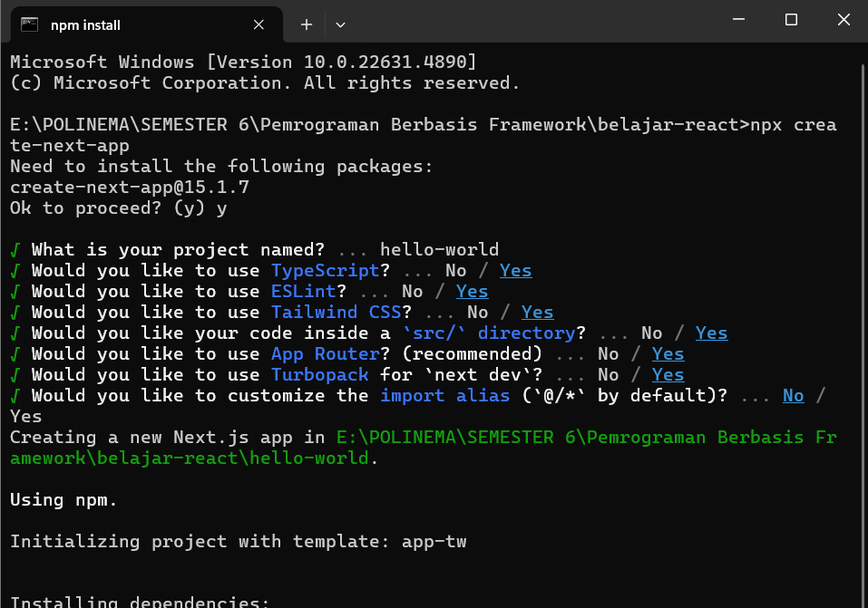
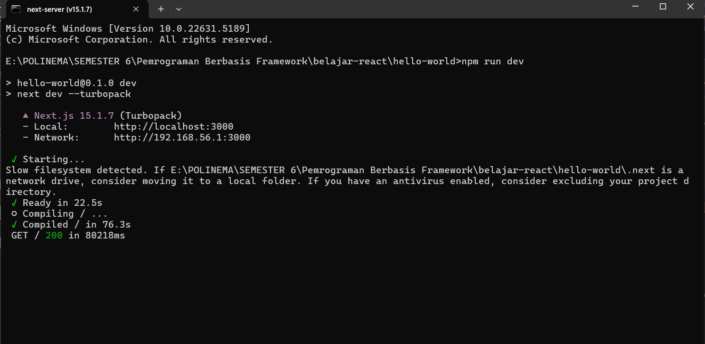
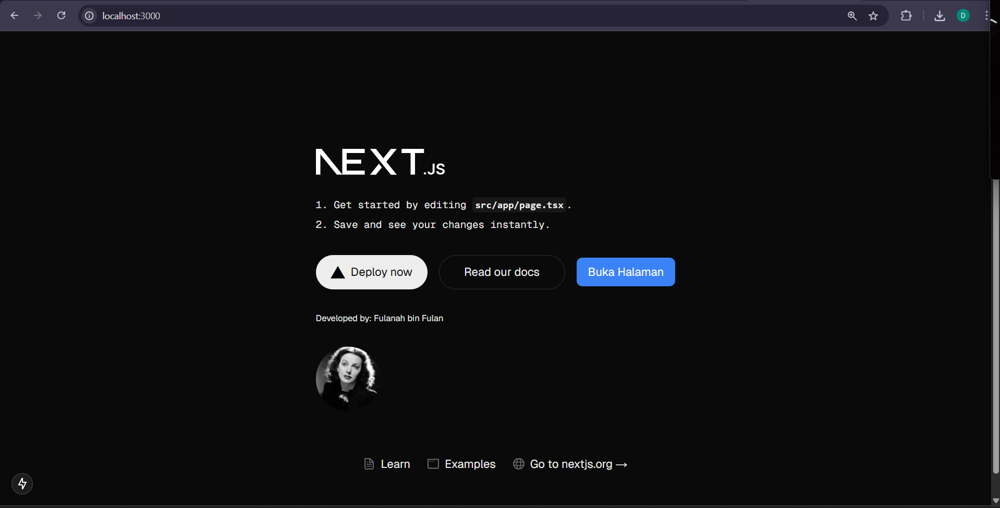

This is a [Next.js](https://nextjs.org) project bootstrapped with [`create-next-app`](https://nextjs.org/docs/app/api-reference/cli/create-next-app).

## Getting Started

First, run the development server:

```bash
npm run dev
# or
yarn dev
# or
pnpm dev
# or
bun dev
```

Open [http://localhost:3000](http://localhost:3000) with your browser to see the result.

You can start editing the page by modifying `app/page.tsx`. The page auto-updates as you edit the file.

This project uses [`next/font`](https://nextjs.org/docs/app/building-your-application/optimizing/fonts) to automatically optimize and load [Geist](https://vercel.com/font), a new font family for Vercel.

## Learn More

To learn more about Next.js, take a look at the following resources:

- [Next.js Documentation](https://nextjs.org/docs) - learn about Next.js features and API.
- [Learn Next.js](https://nextjs.org/learn) - an interactive Next.js tutorial.

You can check out [the Next.js GitHub repository](https://github.com/vercel/next.js) - your feedback and contributions are welcome!

## Deploy on Vercel

The easiest way to deploy your Next.js app is to use the [Vercel Platform](https://vercel.com/new?utm_medium=default-template&filter=next.js&utm_source=create-next-app&utm_campaign=create-next-app-readme) from the creators of Next.js.

Check out our [Next.js deployment documentation](https://nextjs.org/docs/app/building-your-application/deploying) for more details.

## Laporan Praktikum

NIM   : 2241720195
Nama  : Daffa Reyhansyah Ahmad
Kelas : TI - 3C

### Praktikum 1: Menyiapkan Lingkungan Pengembangan
1. Jelaskan kegunaan masing-masing dari Git, VS Code dan NodeJS yang telah Anda install pada sesi praktikum ini!
> - Git berfungsi sebagai sistem version control untuk memantau perubahan dalam kode sumber,mendukung kolaborasi antar developer, serta menyimpan proyek pada layanan seperti GitHub.
> - VS Code merupakan text editor yang biasa digunakan untuk menulis, mengedit, dan mengelola kode dengan berbagai bahasa pemrograman yang ada.
> - Node.js adalah runtime environment yang memungkinkan menjalankan kode JavaScript di sisi server (di luar browser) dan menyediakan manajemen package melalui NPM (Node Package Manager).

2. Buktikan dengan screenshoot yang menunjukkan bahwa masing-masing tools tersebut telah berhasil terinstall di perangkat Anda!
> 


### Praktikum 2: Membuat Proyek Pertama React Menggunakan Next.js

1. Pada Langkah ke-2, setelah membuat proyek baru menggunakan Next.js, terdapat beberapa istilah yang muncul. Jelaskan istilah tersebut, TypeScript, ESLint, Tailwind CSS, App Router, Import alias, App router, dan Turbopack!
> - TypeScript adalah bahasa pemrograman turunan JavaScript yang menambahkan sistem pengetikan untuk mendeteksi kesalahan sejak awal.
> - ESLint adalah alat bantu yang digunakan untuk memastikan kode tetap bersih dan mengikuti aturan penulisan tertentu.
> - Tailwind CSS adalah framework utility-first yang menyediakan class-class siap pakai untuk mempercepat proses styling.
> - App Router merupakan sistem navigasi terbaru di Next.js yang berbasis direktori app/ untuk mengatur halaman dan layout.
> - Import alias digunakan untuk menyederhanakan penulisan path saat mengimpor modul, misalnya dengan menyingkat ../../components/Navbar menjadi @/components/Navbar.
> - Turbopack adalah bundler modern pengganti Webpack yang dirancang untuk membangun aplikasi Next.js dengan lebih cepat dan efisien.

2. Apa saja kegunaan folder dan file yang ada pada struktur proyek React yang tampil pada gambar pada tahap percobaan ke-3!
> - .next/ berisi file hasil kompilasi dan build dari proyek Next.js yang dibuat secara otomatis.
> - node_modules/ menyimpan semua package dan dependensi proyek yang diinstal menggunakan npm/yarn.
> - public/ digunakan untuk menyimpan file statis seperti gambar dan favicon yang bisa diakses langsung.
> - src/app/ merupakan lokasi utama file dan komponen proyek ketika menggunakan sistem App Router.
> - layout.tsx adalah file layout utama yang biasa digunakan untuk komponen global seperti header atau footer.
> - page.tsx berisi konten dari halaman yang ditampilkan pada rute tertentu dalam aplikasi.

3. Buktikan dengan screenshoot yang menunjukkan bahwa tahapan percobaan di atas telah berhasil Anda lakukan!
> 

> 

### Praktikum 3: Menambahkan Komponen React (Button)

1. Buktikan dengan screenshoot yang menunjukkan bahwa tahapan percobaan di atas telah berhasil Anda lakukan!

> 

### Praktikum 4: Menulis Markup dengan JSX

1. Untuk apakah kegunaan sintaks user.imageUrl?
> Sintaks user.imageUrl digunakan untuk mengakses properti imageUrl dari objek user, yang biasanya berisi alamat URL gambar dan digunakan sebagai nilai untuk atribut src pada elemen gambar ().

2. Buktikan dengan screenshoot yang menunjukkan bahwa tahapan percobaan di atas telah berhasil Anda lakukan!
> 
